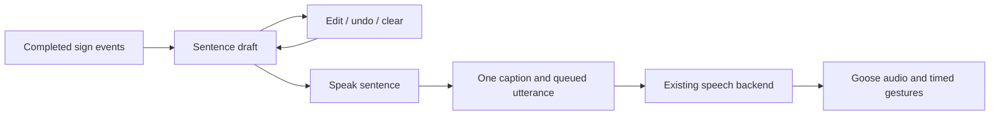

# Goose sentence composition: implementation investigation

Investigated and implemented against the working tree on September 20, 2026.

## Implementation status

The manual composer is implemented in `mobile/src/session/sentence.ts`, the
session reducer, and the new `SentencePanel.tsx`. Live recognition appends
canonical tokens; Speak sentence commits one immutable caption and speech request.
Undo, Clear, and draft editing are available. With voice off, Save sentence stores
one caption. Drafts survive capture interruptions and require explicit continuation.
Edited text is held until submission or clearing. The exact four-token presentation
template, 500-character final limit, and majority-expression policy are included.

The existing voice adapter, backend, and native recognition contract are reused.
The sample conversation still uses its labeled demo captions. Automatic sentence
boundaries and general grammar translation remain follow-ups. `captionPresentation.ts`
and the demo `CaptionPanel.tsx` retain their existing behavior; the dedicated live
panel shows both the draft and the last submitted sentence.

Implementation checks on the integration with main: 107 mobile tests (including
13 sentence-composition cases), 47 goose tests, and 11 mocked backend voice tests
pass, along with TypeScript checks for mobile and goose. The installed simulator app
was used to verify draft editing and manual submission with voice off. Its native
camera module is older than version 5, so real sign capture still requires the
current native build and a physical phone. No paid synthesis was used.

The sections below retain the original investigation, design rationale, and
follow-up considerations; references to the original per-sign behavior are historical.

## Recommendation

Add a sentence composer between completed sign recognition and the existing
caption/voice queue. Accumulate completed signs into an editable draft, then
commit that draft as one utterance. Start with an explicit **Speak sentence**
action; add automatic sentence boundaries after testing signing cadence on a phone.

The voice path already takes complete text. The first implementation can stay in
the Expo consumer app, reuse the current backend and goose, and require no new AI
dependency or recognition model.



## Behavior before sentence composition

| Component | Current behavior | Consequence |
| --- | --- | --- |
| `mobile/src/integrations/localSign.ts` | Maps the 11 presentation labels to display text; emits `recognized-sign` for a completed attempt. | We have distinct completed sign events to accumulate. Some mapped strings already contain final punctuation. |
| `mobile/src/session/model.ts`, `translate()` | Immediately converts each `recognized-sign` into `accepted`, then creates a `Phrase` and starts or queues speech. | This is the point where individual signs become separate utterances. |
| `mobile/src/session/useConversation.ts` | Sends the current speech object's complete text and emotion to the voice adapter. | Can already submit a whole sentence unchanged. |
| `mobile/src/session/captionPresentation.ts` | Shows `state.draft` only when there is no previous phrase. | Simply appending to the existing draft would hide subsequent sentences. |
| `mobile/src/integrations/speechTransport.ts` and `backend/voice.py` | Accept text up to 500 characters. | No word-only restriction exists in the speech API. |
| `mobile/src/integrations/voicePlayback.ts` | Plays one audio clip and derives timed goose gestures from returned alignment. | A whole-sentence clip can reuse the same playback clock and alignment. |
| `goose/src/voice/phrase.ts` | The separate prototype has a `ready` flag for draft versus finished text. | A related concept exists, but its direct-provider hook is not the consumer app's speech adapter. |

A local reducer probe produced:

```text
Input:    TODAY → WE → SHOW → PHONE
Captions: ["Today", "We", "Show", "Phone"]
Speaking: "Today"
Queued:   ["We", "Show", "Phone"]

Input:    one accepted event, "Today we show the phone."
Captions: one
Speaking: "Today we show the phone."
Queued:   none
```

The second input was supplied text for the probe; the current recognizer does
not generate that sentence or its article automatically.

## Proposed first implementation

### 1. Keep structured completed tokens

Introduce a `SentenceDraft` in the session model, separate from the rolling
`signPreview`, demo translation draft, and committed transcript. Its token list
should retain canonical label, display text, capture ID, attempt ID, observation
time, and the emotion snapshot attached to the completed sign. Give each draft
its own ID and revision.

Preserve the canonical label through `localSign.ts` and the translation contract;
native predictions already include it. Do not reconstruct `THANKYOU` or
`ILOVEYOU` from capitalized, punctuated UI strings.

Only completed events enter this token list. Previews can change repeatedly and
must remain visually tentative. Retain the existing freshness and ordering checks.
An already-seen `(captureId, attemptId)` cannot append again; a later attempt of
the same label is legitimate repetition. Undoing, clearing, or committing a draft
must not reset the current capture's recognized-attempt watermark.

### 2. Compose text locally

Use a small formatter with canonical token text, capitalization, and final
punctuation. Treat multiword signs as complete units and preserve the pronoun
“I”. Avoid joining the existing display strings into output such as
“Hello. My Name”. Keep the raw token sequence alongside the formatted sentence.

Joining tokens alone can produce understandable fragments, but does not supply
grammar. For the current presentation, add explicit, reviewed templates where
needed. For example, the exact sequence `TODAY WE SHOW PHONE` could render as
“Today we show the phone.” That article is an intentional template rule.

Names must come from actual input. `HELLO MY NAME` cannot supply “Aurelio” by
itself: the Expo camera contract currently emits word predictions, not the
standalone scanner's fingerspelling output. A typed name field or separate
fingerspelling integration would be required for that introduction.

### 3. Commit one immutable utterance

Add actions for undoing the last token, clearing/editing the draft, and committing
the sentence. A commit checks its draft ID/revision and nonempty text, takes an
immutable snapshot, creates one `Phrase`, and uses the existing playback queue.
Clear the committed draft immediately so a double tap cannot submit it twice.

Only completed tokens visible in the draft are committed. A later native
completion goes into the next draft, including when its preview was already
visible at commit time. Keep that preview separate so the user can see it was not
included. Signing the next sentence must not interrupt the previous sentence's
audio. Speech completion updates delivery status without clearing the new draft.

For sentence emotion, a simple first policy is the most frequent token snapshot,
with ties resolving to neutral. Freeze the result on commit so a new facial
expression cannot change queued speech; replay and correction retain it. This is
a proposed delivery policy, not an inference of ASL grammar or inner feelings.

Enforce the existing 500-character limit on the final rendered/edited text.
Retain the draft and explain overflow instead of truncating words. When voice is
off, the equivalent action saves one caption and makes no speech request.

### 4. Make the draft visible and correctable

Update caption presentation to show the sentence being built even after a
previous sentence exists. Keep its **Draft · not spoken** label distinct from the
last committed caption and its playback status. Provide **Speak sentence**,
**Undo**, **Clear**, and **Edit** controls using the current design tokens.

Draft editing needs a separate action from the current correction action, which
edits and immediately re-speaks the last transcript item. If the user edits text,
commit that revision before accepting further appended tokens; otherwise a later
token could silently overwrite their edit. Opening the editor suspends capture
through the existing sheet lifecycle.

Preserve completed draft tokens through sheets, backgrounding, and tracking loss;
cancel automatic commit timers and clear only tentative previews. Reject events
from the previous capture generation. After resuming, require explicit continuation
or submission of the retained draft before combining it with new signing. End
conversation clears the draft with the transcript. Retry/sign-again should have
an explicit draft-discard meaning instead of silently losing a partial sentence.

## Automatic sentence boundaries: a second step

The current native segmenter uses a 250 ms movement-rest hold, a 600 ms static
dwell, and a 500 ms minimum gap. Those are individual-sign settings, not sentence
boundaries. The basic adapter also resets on missing hands rather than treating
tracking loss as completion.

A longer idle window, initially around 1.5–2 seconds for experiments, is a tuning
candidate rather than a validated default. A timer based only on the last
completed token could expire in the middle of the next sign. Conversely, rolling
preview predictions are not reliable activity signals: they continue on observed
hands, including holds.

For reliable automatic commit, expose native attempt/activity information through
the camera contract: fresh observed rest versus movement, active attempt, and
pending completed recognition work. Commit only after fresh rest, with no active
attempt or pending completion. On stale frames, camera loss, sheet opening, pause,
or draft revision, invalidate the timer. Carry draft ID/revision and capture
generation in its action so an old callback cannot submit new text. This native
contract extension requires a version check and rebuild.

Keep the manual action available. Measure premature splits and merged sentences
on real signing sequences before choosing an automatic threshold. The current
isolated-sign matcher still needs pauses between words; removing that requirement
would be a separate continuous-recognition project.

## Existing AI caption endpoint

`backend/service.py:Service.caption()` is not ready to plug into this flow:

- Its vocabulary has six older labels, including `THANK_YOU` and `I_LOVE_YOU`,
  while the camera uses 11 labels including `THANKYOU` and `ILOVEYOU`.
- Its prompt and meaning guard require exactly the same glossary words in the
  same order. Adding “is” or “the” fails that guard.
- Its fallback puts periods between individual signs.
- The consumer camera path does not call it, and voice-only backend mode leaves
  `/v1/caption` unavailable.

If broader English rendering is wanted later, define a distinct composition
contract with the current vocabulary, raw source tokens, rendered text, explicit
handling of missing information, a local fallback, and stale-response checks.
Review the meaning guard and upload-consent scope for that additional provider.
Do not silently reuse the classifier's vocabulary or relax its existing guard.
The manual composer and limited templates need none of this infrastructure.

## Files and verification

| Files | Planned change |
| --- | --- |
| `mobile/src/integrations/contracts.ts`, `localSign.ts` | Preserve canonical labels on completed tokens. |
| New `mobile/src/session/sentence.ts` | Token formatting, supported templates, limits, and sentence emotion policy. |
| `mobile/src/session/model.ts` | Draft state, actions, atomic commit, lifecycle retention, and sentence-level queuing. |
| `mobile/src/session/captionPresentation.ts`, `CaptionPanel.tsx` | Persistent sentence draft and composition controls. |
| `mobile/src/session/ConversationSheets.tsx` | Draft editing distinct from transcript correction. |
| `mobile/src/session/useConversation.ts` | Optional later boundary timer; retain existing voice effect for the first version. |
| `mobile/tests/session.test.ts`, `recognition-integration.test.ts`, `live-integration.test.ts`, `presentation.test.ts` | Replace assumptions that every sign speaks immediately; verify the new user flow. |

Acceptance checks for implementation:

1. Four completed signs produce a visible draft and zero speech requests; one
   commit produces one transcript item and one request with the complete text.
2. Repeated preview updates and duplicate completion events never append twice;
   deliberate repeated signs remain possible, including after undo/clear/commit.
3. Multiword tokens, capitalization, template output, manual edits, empty drafts,
   and the final 500-character limit behave predictably.
4. A new draft remains visible while the previous sentence plays. Two committed
   sentences play in order; double commits and old playback callbacks are ignored.
5. Pause, sheets, tracking loss, and backgrounding retain completed draft text but
   reject old observations. Mute, consent revocation, and voice failure preserve
   text and keep existing cancellation behavior.
6. Phone checks confirm complete audio, usable cadence, sentence boundaries, and
   goose timing. Unit tests cannot establish recognition accuracy or speech quality.

Investigation validation: 37 existing mobile tests passed across recognition,
live integration, session behavior, and timed gestures. All 10 backend voice tests
passed with mocked provider responses; their temporary loopback servers required
execution outside the filesystem sandbox's network restriction. The reducer probe
above used the actual adapter and reducer without audio or provider calls. No
paid synthesis or device playback was performed.
